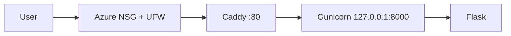

# Cloud Project: Peminjaman Perangkat Lab

Cloud Computing, PTI 2802. Pertemuan 3: Project Inception.

## Author
Muhammad Rifka Z / 25832072009

## Problem
Administrator laboratorium kesulitan memantau peminjaman perangkat
secara terpusat. Sistem akan menyediakan pencatatan perangkat,
peminjaman, dan status pengembalian sehingga penggunaan perangkat
dapat ditelusuri.

## Target Users
- Administrator laboratorium
- Mahasiswa peminjam perangkat

## Features M03
- baseline aplikasi Flask
- health endpoint (`/health`) dan info endpoint (`/api/info`)
- deployment di Azure VM

## Architecture



## Infrastructure
- Azure VM Standard B2ats v2 (2 vCPU, 1 GiB RAM), Indonesia Central
- Ubuntu Server 24.04, Caddy, Gunicorn, systemd, UFW

## Public Endpoint
`http://70.153.8.25/`

## Health Check
`GET /health`

## Run Locally

```bash
python3 -m venv .venv
source .venv/bin/activate
pip install -r requirements.txt
flask --app app run
```

## Deployment
Lihat `docs/deployment.md`.

## Security
- SSH key-only, root login nonaktif
- UFW dan Azure NSG aktif
- backend loopback-only

## Current Limitations
- HTTP only, tanpa database, tanpa container, deployment manual

## Roadmap
M04 DNS/HTTPS, M05 Data, M06 Container, M07 IaC, M09 CI/CD
