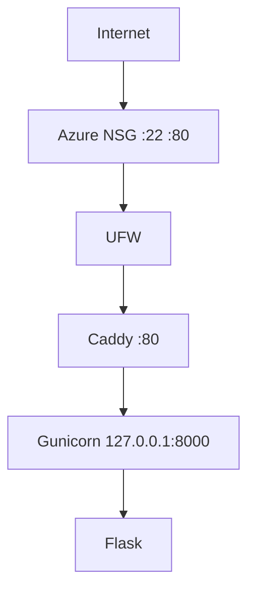

# Architecture v0.1

## Deployment View

## Resource Constraints
- Azure VM Standard B2ats v2, region Indonesia Central
- 2 vCPU, 1 GiB RAM (887 MiB usable), swap 1 GiB
- Disk OS 29 GB

## Security Decisions
- administrasi memakai user non-root (cloudstudent)
- SSH key authentication (Ed25519), password SSH dinonaktifkan
- root login SSH dinonaktifkan, AllowUsers cloudstudent
- dua lapis firewall: Azure NSG dan UFW
- backend loopback-only
- GitHub deploy key per repository

## Current Limitations
- HTTP only
- single VM
- tidak ada database
- tidak ada container
- tidak ada CI/CD, deployment manual

## Planned Evolution
- M04 DNS + HTTPS
- M05 persistent data
- M06 container
- M07 IaC
- M09 CI/CD
